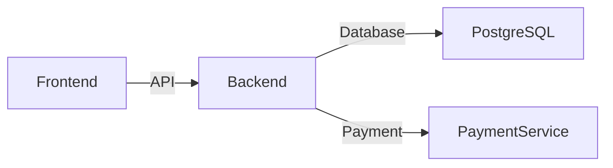

    <picture>
      <source media="(prefers-color-scheme: dark)" srcset="./.imgs/header.jpg">
      
    </picture>

Welcome to SCSSleon CSS framework ! It's the most advanced responsive front-end framework, that can boost development of your website or project. It was built in love and with love from internet technologies. Peace ! 

– [ <a href="http://nulllogic.github.io/scssleon-docs" target="_self">Documentation</a> ] — [ <a href="https://github.com/nulllogic/scssleon/issues" target="_blank">Bugs/Issues</a> ] — [ <a href="https://stackoverflow.com/questions/tagged/scssleon" target="_blank">StackOverflow</a> ] –

  

## ┌ 🧭 Quickstart ┐

## ┌ 📚 Documentation ┐

  

SCSSleon's documentation is built with [Astro](https://astro.build/) and publicly hosted on GitHub Pages at <https://nulllogic.github.io/scssleon-docs/>. The docs may also be run locally.

Documentation search is powered by [Algolia's DocSearch](https://community.algolia.com/docsearch/).

### ─ Running documentation locally

1. From the root `/` directory, run `make docs` in the command line.
2. Open `http://localhost:8000/scssleon/` in your browser.
3. Enjoy the documentation locally

## ┌ Contributing ┐

  

> For contributing, please view the [CONTRIBUTING](CONTRIBUTING.md).

## ┌ Thanks ┐

  

 
Thanks to [BrowserStack](https://www.browserstack.com/) for providing the infrastructure that allows us to test in real browsers!

## ┌ 📜 License ┐
[MIT license](LICENSE)

<!--
