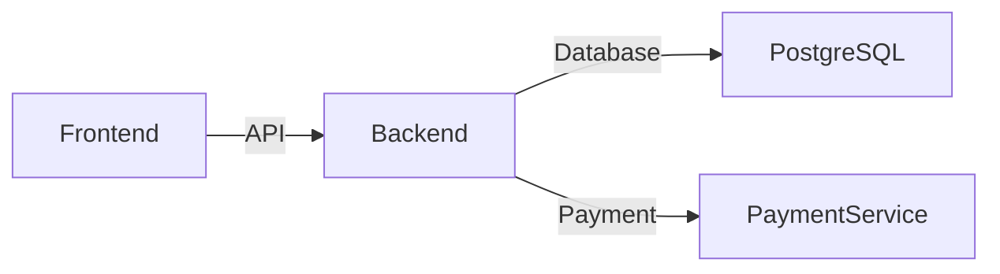

    <picture>
      <source media="(prefers-color-scheme: dark)" srcset="./.imgs/header.jpg">
      
    </picture>

Welcome to XII/Grid CSS framework ! It's the most advanced responsive front-end framework, that can boost development of your website or project. It was built in love and with love from internet technologies. Peace ! 

– [ <a href="https://nulllogic.github.io/xiigrid/">Demo</a> ] — [ <a href="http://nulllogic.github.io/xiigrid/docs">Documentation</a> ] — [ <a href="https://github.com/nulllogic/xiigrid/issues">Bugs/Issues</a> ] — [ <a href="https://stackoverflow.com/questions/tagged/xiigrid">StackOverflow</a> ] –

  

## ┌ Quickstart ┐

## ┌ Documentation ┐

  

xiigrid's documentation, included in this repo in the root directory, is built with [Hugo](https://gohugo.io/) and publicly hosted on GitHub Pages at <https://nulllogic.github.io/xiigrid//>. The docs may also be run locally.

Documentation search is powered by [Algolia's DocSearch](https://community.algolia.com/docsearch/). Working on our search? Be sure to set `debug: true` in `site/assets/js/search.js`.

### ─ Running documentation locally

1. From the root `/` directory, run `make docs` in the command line.
2. Open `http://localhost:8000/xiigrid/` in your browser.
3. Enjoy the documentation locally

Learn more about using Hugo by reading its [documentation](https://gohugo.io/documentation/).

## ┌ Contributing ┐

  

> For contributing, please view the [CONTRIBUTING](CONTRIBUTING.md).

## ┌ Thanks ┐

  

 
Thanks to [BrowserStack](https://www.browserstack.com/) for providing the infrastructure that allows us to test in real browsers!

## ┌ License ┐

  

[MIT license](LICENSE)

