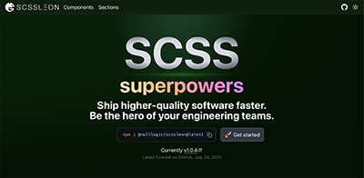
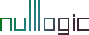

<p align="left">
    <picture>
      <source media="(prefers-color-scheme: dark)" srcset="./.imgs/header_dark.jpg">
      
    </picture>
</p>

# SCSSLEON [](https://github.com/Tencent/QMUI_Web/ "Version Number")

Welcome to SCSSLEON framework ! It's the most advanced responsive front-end framework, that can boost development of your website or project. It was built in love and with love from internet technologies. Peace ! 

<hr />

<p align="center">
– [ <a href="http://nulllogic.github.io/scssleon-docs" target="_self">Documentation</a> ] — [ <a href="https://github.com/nulllogic/scssleon/issues" target="_blank">Bugs/Issues</a> ] — [ <a href="https://stackoverflow.com/questions/tagged/scssleon" target="_blank">StackOverflow</a> ] –
</p>

<hr />

## Table of Contents
<details>
    <summary>↪ ≡˚ ✧ ━━━━⊱TOC⊰━━━━ ✧ ₊˚≡</summary>
<br />

- [Why SCSSLEON?](#user-content---why-scssleon--)
- [Features](#user-content---features-)
- [Getting started](#user-content---getting-started-)
- [Usage Examples](#user-content---usage-examples-)
- [Showcase](#user-content---showcase-)
- [Documentation](#user-content---documentation-)
- [Contributing](#user-content--contributing-)
- [Thanks](#user-content--thanks-)
- [License](#user-content---license-)
<br />
</details>

<hr />


### ⓘ Prerequisites
- Knowledge of [SCSS](https://sass-lang.com).
- [🐳 Docker](https://www.docker.com)
- [💻 Node](https://nodejs.org) + [📦 NPM](https://nodejs.org)

<hr />

## ┌ 🤔 Why SCSSLEON ? ┐ 

SCSSLEON is designed for developers who want a lightweight, modular, and highly customizable SCSS framework. Unlike other frameworks, SCSSLEON:

- Offers a minimal footprint for faster load times.
- Provides intuitive mixins and utilities for rapid development.
- Supports easy theming with customizable variables.
- Color scheme support – easily add dark and light theme support
- Responsive support with zero efforts
- Easy to learn, easy to use
- Zero dependencies, except SASS

<p align="right">(<a href="#readme-top">back to top</a>)</p>

<hr />

## ┌ ✨ Features ┐

- **Responsive Grid System**: Build flexible layouts with a customizable 12-column grid.
- **Theming Support**: Easily customize colors, fonts, and spacing with SCSS variables.
- **Utility Classes**: Includes helpers for spacing, typography, and visibility.
- **Lightweight**: Minimal CSS output for faster performance.
- **Modern CSS**: Built-in support for Flexbox, CSS Grid, and custom properties.

<p align="right">(<a href="#readme-top">back to top</a>)</p>

<hr />

## ┌ 🧭 Getting Started ┐

<details>
    <summary> Method #1 - NodeJS + NPM basic setup [ 🛖🔥🦴 primitive ] </summary>
<br />

1. Install packages – run the following command in your project directory to install SCSSLEON + SASS:

```bash
npm i @nulllogic/scssleon sass
```

2. Initialize your project (if not already done). If your project doesn't have a package.json file, create one by running:

```bash
npm init -y
```

3. Update `package.json` file. Add following strings

```json
"scripts": {
  "sass-dev": "sass --watch --update --style=expanded styles:assets/css --load-path=node_modules",
  "sass-prod": "sass --no-source-map --style=compressed styles:assets/css --load-path=node_modules"
}
```

It will look like this : 
```json
{
  "dependencies": {
    "@nulllogic/scssleon": "^1.0.5",
    "sass": "^1.89.2"
  },
  "name": "test",
  "version": "1.0.0",
  "main": "index.js",
  "devDependencies": {},
  "scripts": {
    "sass-dev": "sass --watch --update --style=expanded styles:assets/css --load-path=node_modules",
    "sass-prod": "sass --no-source-map --style=compressed styles:assets/css --load-path=node_modules"
  },
  "keywords": [],
  "author": "",
  "license": "ISC",
  "description": ""
}
```

4. Create `app.scss` inside your project in `/styles` directory

```scss
@use 'sass:map';
@use "sass:string";

@forward "@nulllogic/scssleon/scss/mixins";
@forward "@nulllogic/scssleon/scss/functions";

@use "@nulllogic/scssleon/scss/config.scss" as config with (
  // This is main config, that you can tweak
  $config: (
    prefix: "xii",
    enable: (
      wrapper: false,
    ),
  )
);

@use "@nulllogic/scssleon/themes/default.scss" as theme with (
  $config : config.$config,
  $theme: (
    html : (
      body : (
        _colors: (
          light : (
            background : rgb(244, 244, 244),
            color: rgb(28, 29, 31),
          ),
          dark : (
            background : rgb(5, 17, 4),
            color: '#ccc'
          )
        )
      )
    )
  )
);

$config: config.$config;
$theme: theme.$theme;
```

5. Create `base.scss` inside your project in `/styles/components` directory
```scss
// Loading your SCSS module with pre-defined config and theme
// ↓ Config
@use "../app.scss" as app;

// Loading modules and components
// ↓ Root
@use "@nulllogic/scssleon/scss/root" with (
    $config: app.$config,
    $theme: app.$theme
);

// Great reset
@use "@nulllogic/scssleon/scss/reset" with (
    $config: app.$config,
    $theme: app.$theme
);

// Base
@use "@nulllogic/scssleon/scss/base" with (
    $config: app.$config,
    $theme: app.$theme
);
```

6. Run node command at root `/` of your project to generate CSS code to `/assets/css`

```bash
npm run sass-dev
```

7. Profit – you have output at `/assets/css` directory now 🙌


</details>

<p align="right">(<a href="#readme-top">back to top</a>)</p>

<hr />

## ┌ 👓 Usage Examples ┐

<p align="right">(<a href="#readme-top">back to top</a>)</p>

<hr />

## ┌ 📺 Showcase ┐

<table width="100%" border="0" colspan="0" rowspan="0">
  <tr>
    <td width="50%">
    <a href="https://nulllogic.github.io/scssleon-docs/" target="_blank" title="SCSSleon documentation"><picture>
      
    </picture></a>
    </td>
    <td>2</td>
   </tr> 
   <tr>
      <td>1</td>
    <td>2</td>
  </td>
  </tr>
</table>

<p align="right">(<a href="#readme-top">back to top</a>)</p>

<hr />

## ┌ 📚 Documentation ┐

SCSSLeon documentation is available here [http://nulllogic.github.io/scssleon-docs](http://nulllogic.github.io/scssleon-docs)

Documentation is built with [Astro](https://astro.build/) and publicly hosted on GitHub Pages [here](http://nulllogic.github.io/scssleon-docs).
Search is powered by [Algolia](https://community.algolia.com/docsearch/).

<p align="right">(<a href="#readme-top">back to top</a>)</p>

<hr />

## ┌ Contributing ┐

For contributing, please view the [CONTRIBUTING](CONTRIBUTING.md).

<p align="right">(<a href="#readme-top">back to top</a>)</p>

<hr />

## ┌ Thanks ┐

<a href="https://www.browserstack.com" title="BrowserStack" target="_blank">
    <picture>
      <source media="(prefers-color-scheme: dark)" srcset="./.imgs/bstack-logo-global.svg">
      
    </picture>
</a><br />

Thanks to [BrowserStack](https://www.browserstack.com/) for providing the infrastructure that allows us to test in real browsers!

<p align="right">(<a href="#readme-top">back to top</a>)</p>

<hr />

## ┌ 📜 License ┐
[MIT license](LICENSE)

<hr />

<p align="center">
  <a href="https://nulllogic.net/" target="_blank">
    <picture>
      <source media="(prefers-color-scheme: dark)" srcset="./.imgs/logo_nulllogic_dark.png">
      
    </picture>
  </a>
</p>