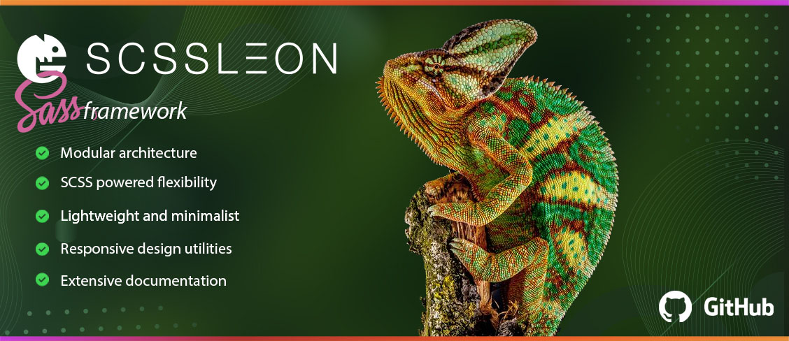

  

Welcome to 24grid CSS framework ! It's the most advanced responsive front-end framework, that can boost development of your website or project. It was built in love and with love from internet technologies. Peace ! 

– [ <a href="https://nulllogic.github.io/24grid/">Demo</a> ] — [ <a href="http://nulllogic.github.io/24grid/docs">Documentation</a> ] — [ <a href="https://github.com/nulllogic/24grid/issues">Bugs/Issues</a> ] — [ <a href="https://stackoverflow.com/questions/tagged/24grid">StackOverflow</a> ] –

  

## Quickstart

## Optional

### └  Contributing

> For contributing, please view the [CONTRIBUTING](CONTRIBUTING.md).

## Thanks
 
Thanks to [BrowserStack](https://www.browserstack.com/) for providing the infrastructure that allows us to test in real browsers!

## License
[MIT license](LICENSE)
